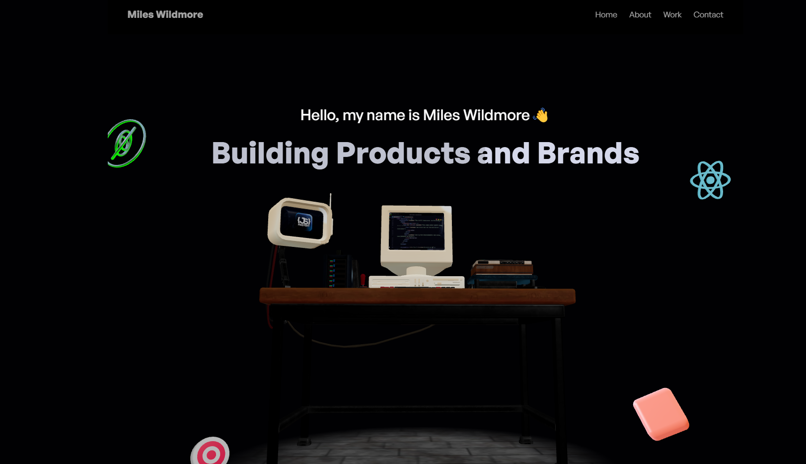

# 3D Portfolio



Welcome to my portfolio! This shows all of my work that I have done to show what my passion is about as well as my previous work that I have done.

# Link

## Table of Contents
* [Description](#description)
* [Installation](#installation)
* [Usage](#usage)
* [License](#license)
* [Contributing](#contributing)
* [Tests](#tests)
* [Resources](#resources)

## Installation
You will need these npm (Node Package Manager) in order to view my portfolio. You will navigate to the root of the directory of the package.json file, navigate to "Open in Integrated Terminal" and enter these commands to install the packages:
```
npm install
npm install gsap
npm install react-globe.gl
npm install react-responsive
npm install @gsap/react
npm install @emailjs/browser
npm install maath
npm install leva
npm install @react-three/drei
npm install @react-three/fiber
npm install three
npm install @react-three/eslint-plugin
```


## Usage
You can use the "Node.js" terminal to check out my portfolio, and checkout information about what I have to offer.

## License
[](https://opensource.org/licenses/MIT)

## Contributing
All the contributions to this project is all done by Miles Wildmore.


## Tests

To test out my portfolio, you will need to run the server by typing this in the terminal and open the localhost from the root directory with this command:
```
npm run dev

```

If you want to leave Brainwave in the terminal, hold "CTRL+C" ("CMD+C" for Mac) to stop hosting localhost.

## Resources
Link to where my avatar came from: https://readyplayer.me/

Link to convert gltf files to react: https://gltf.pmnd.rs/

Link to convert gltf files to fbx files for animations: https://products.aspose.app/3d/conversion/gltf-to-fbx#google_vignette

Link to the animation of the avatar: https://www.mixamo.com/

Link to the GSAP page: https://gsap.com/

Link to npm page : https://www.npmjs.com/

Link to get node.js: https://nodejs.org/